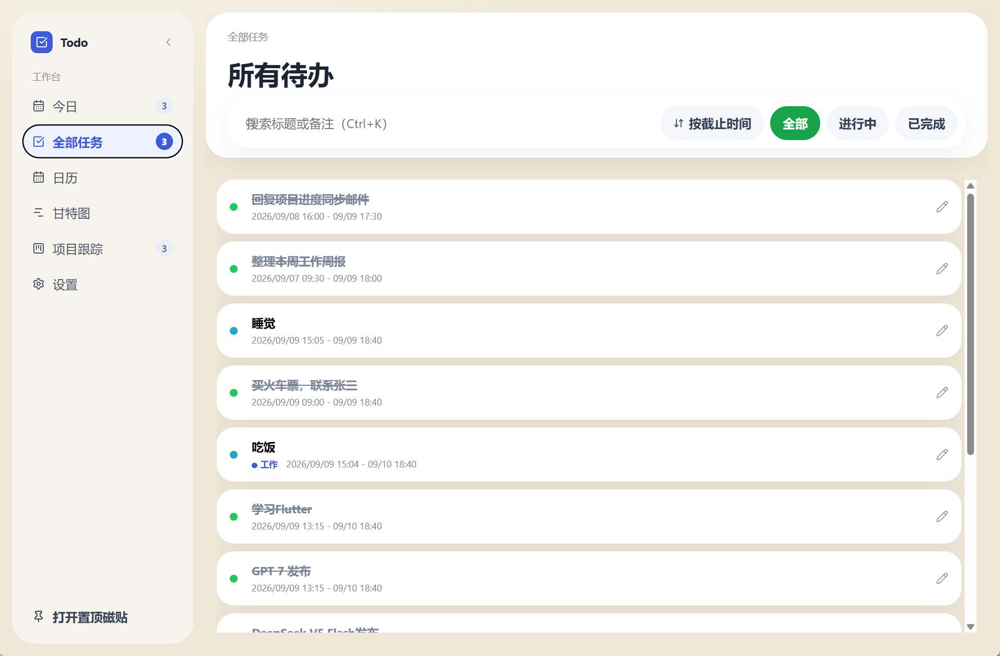
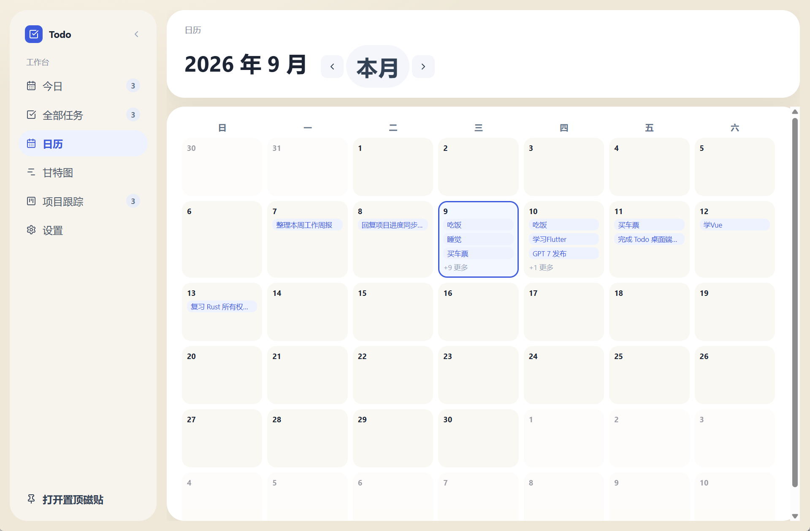
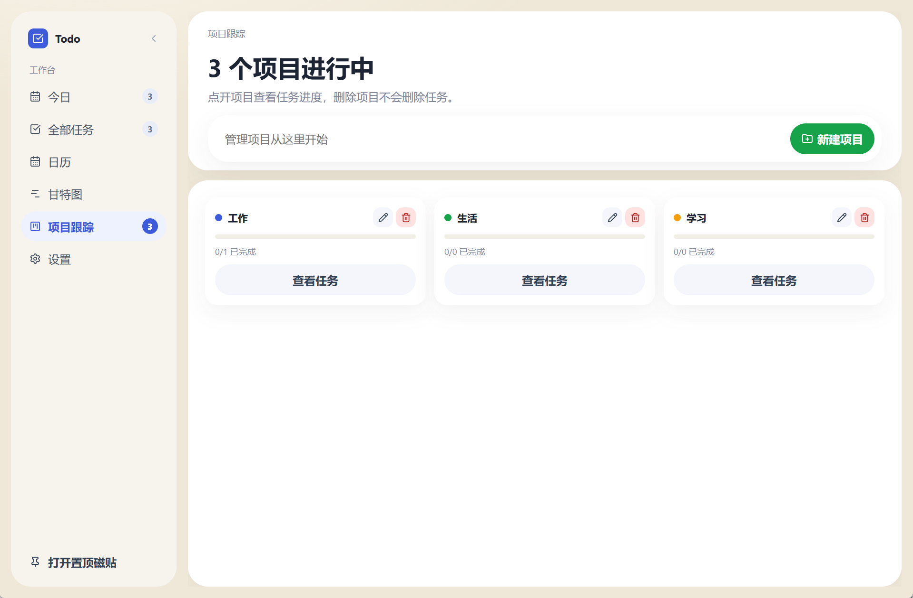
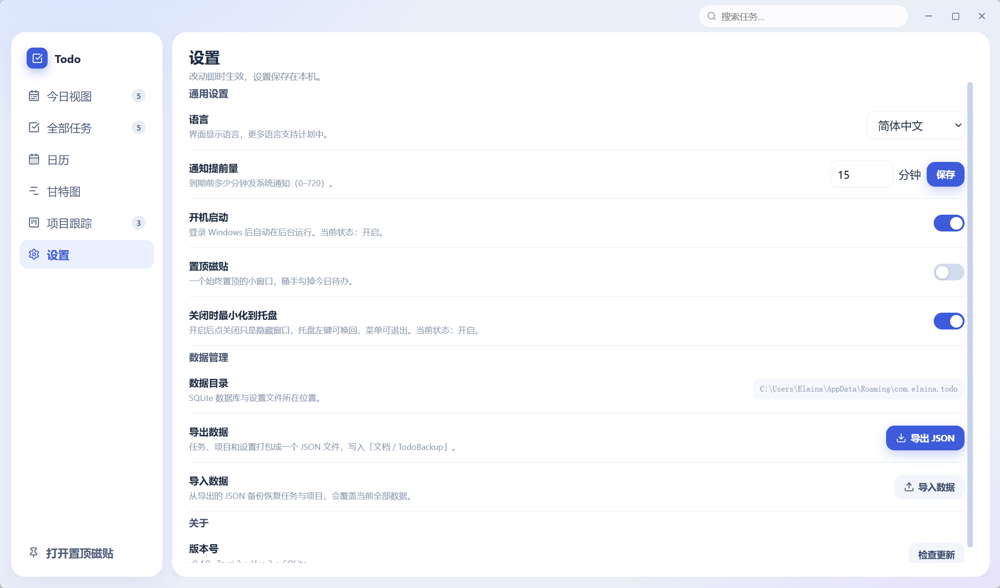
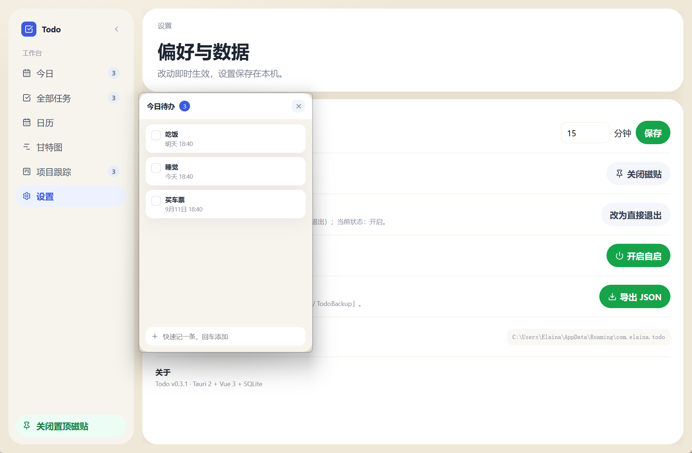

<div align="center">

# rust-todo

基于 **Tauri 2 + Vue 3 + Rust + SQLite** 的 Windows 桌面待办管理应用（v0.4.0）

[](https://github.com/Elari39/rust-todo/actions/workflows/ci.yml)
[](https://github.com/Elari39/rust-todo/releases/latest)
[](LICENSE)
[](#-下载安装)

轻量、本地优先、带系统托盘与置顶磁贴的 Todo 工具。界面用 Vue 还原现代仪表盘风格，业务逻辑、存储与系统集成全部由 Rust 完成。

</div>

---

## ✨ 界面预览

今日视图：


| 全部任务 | 日历 |
| --- | --- |
|  |  |

| 甘特图 | 项目跟踪 |
| --- | --- |
|  |  |

| 设置 | 置顶磁贴（独立小窗） |
| --- | --- |
|  |  |

---

## 🚀 功能特性

### 任务管理

- 今日 / 全部任务 / 日历 / 甘特图四个视图
- 快速任务与详细任务，右侧详情面板完成、编辑、删除
- 排序：「手动 / 按截止时间」切换，手动模式下直接拖拽卡片调整顺序（搜索时暂停拖拽，避免乱序）
- 搜索：标题 + 备注全文匹配并显示匹配条数，`Ctrl+K` 从任意视图跳转聚焦
- 任务详情展示开始/截止、时长与项目归属

### 项目分组

- 新建 / 编辑 / 删除项目（名称 + 预设色板）
- 任务归入项目，项目页以进度条展示完成度
- 删除项目只解绑任务（变为「未分组」），不会删除任务

### 置顶磁贴

- 320×480 无边框小窗：始终置顶、不占任务栏，可拖动、可缩放
- 随手勾任务、快速输入，完成后条目短暂停留 2 秒再淡出
- 与主窗口实时同步：任一窗口的变更即时广播到另一窗口
- 关闭主窗口后磁贴仍可独立使用

### 系统集成

- 系统托盘：左键唤回主窗口，右键菜单（显示主窗口 / 开关磁贴 / 退出）
- 关闭主窗口默认最小化到托盘（设置里可改为直接退出；系统关机时自动放行，不阻塞关机流程）
- 开机自启（注册表 Run 键）
- 单实例保护：二次启动直接聚焦已有主窗口，杜绝双进程写库冲突

### 提醒与数据

- 到期系统通知，提前量 0–720 分钟可配置（默认 15 分钟）
- 已提醒的任务不重复提醒；错过的提醒在 24 小时内补发一次；改期或重新打开的任务自动重新进入提醒流程
- 导出备份：任务 + 项目 + 设置打包成 JSON，写入「文档 / TodoBackup」
- 本地优先：所有数据存本机 SQLite，不联网、不上传

## 🛠 技术栈

| 层 | 技术 |
| --- | --- |
| 桌面框架 | Tauri 2（WebView2、系统托盘、通知、自启、单实例） |
| 前端 | Vue 3（`<script setup>` + Composition API）+ TypeScript + Vite |
| 后端 | Rust，数据库命令统一经 `spawn_blocking` 后台执行 |
| 存储 | SQLite（rusqlite bundled，WAL 模式 + busy_timeout） |
| 测试 | Vitest（前端）/ `cargo test`（后端） |
| CI/CD | GitHub Actions：质量门禁 + tag 触发自动打包发布 |

选择 Tauri 2 而非 Electron 或纯 Rust GUI（egui/iced）：这类圆角卡片、侧栏、日历、甘特图的 Web 风格界面用 Web 技术还原成本最低；相比 Electron，Tauri 复用系统 WebView2，安装包和内存占用小得多，业务层又能完全用 Rust 实现。

## 📦 下载安装

前往 [GitHub Releases](https://github.com/Elari39/rust-todo/releases/latest) 下载（由 CI 自动构建并发布）：

- `Todo_x.y.z_x64-setup.exe` — NSIS 安装包，双击安装
- `Todo_x.y.z_x64_portable.zip` — 免安装便携版，解压后直接运行 `todo.exe`

两者都需要系统 WebView2 Runtime（Windows 10/11 一般已内置）。

## 💻 本地开发

环境要求：Node 20.19+（或 22.12+，Vite 7 的要求）、Rust 1.78+（lockfile v4 格式的要求）和 WebView2 Runtime（Win11 一般自带）。

```bash
npm install
npm run tauri dev        # 开发调试
npm run tauri build      # 打包 NSIS 安装包（target/release/bundle/nsis/）
npm test                 # 前端单测（vitest）
cargo test --manifest-path src-tauri/Cargo.toml   # 后端单测
```

开发须知：

- 磁贴窗口按需创建——在 Windows 上必须在 async command 里创建 webview，同步 command 里创建会得到一个永不绘制的白屏窗口；托盘菜单同样经 async runtime 派发，避免与命令争锁死锁。
- 两个窗口加载同一份前端，按 Tauri 窗口 label（`main` / `tile`）在 `App.vue` 里切换渲染。
- capabilities 按窗口最小权限拆分（`capabilities/main.json` 与 `tile.json`），新增前端能力时记得补对应窗口的权限。

推送 `v*` 标签后，Release 工作流（`.github/workflows/release.yml`）会自动构建安装包与免安装便携版 zip，并挂到对应的 GitHub Release（先为草稿，确认资产后发布）。

## 🗂 项目结构

```
├── docs/img/               # README 截图
├── src/                    # Vue 3 前端
│   ├── components/         # 视图与组件（今日/全部/日历/甘特/项目/设置/磁贴）
│   ├── composables/        # useTasks / useProjects / useSettings / useReminders / useClock
│   ├── utils/              # datetime.ts（时间格式化与到期判定）、reminders.ts（提醒窗口判定）
│   └── api.ts              # invoke 封装
├── src-tauri/              # Rust 后端
│   └── src/
│       ├── db.rs           # SQLite（tasks / projects 表与迁移、示例数据）
│       ├── commands.rs     # #[tauri::command] IPC 层（数据库命令经 spawn_blocking 后台执行）
│       ├── model.rs        # Task / Project / Settings 等数据模型
│       ├── settings.rs     # settings.json 持久化
│       ├── platform.rs     # Windows 关机检测（SM_SHUTTINGDOWN）
│       ├── main.rs         # 入口
│       └── lib.rs          # 托盘、窗口事件、插件注册（单实例 / 通知 / 自启）
└── src-tauri/capabilities/ # Tauri 2 权限声明（main + tile 窗口各自最小权限）
```

## 💾 数据存储与迁移

- 数据库与设置存放在 `%APPDATA%\com.elaina.todo`（`todo.db` + `settings.json`），设置页内可查看完整路径
- `settings.json` 先写临时文件再原子替换；损坏时自动改名备份为 `.bak` 并回落默认值
- 数据库文件损坏时自动备份为 `todo.db.corrupt-时间戳` 再重建，不会卡死启动
- 升级不丢数据：结构自动迁移（v0.2 补 `projects` 表、v0.3 补 `sort_order` 列），设置字段缺失时使用默认值
- 提醒代次自动迁移：升级保留已有提醒状态；改期、重开或导入后，旧通知的确认不会覆盖新提醒。旧版 JSON 备份仍可导入
- 删除整个数据目录即可完全重置

## ❓ 常见问题

**Q：今日页和全部任务页有什么区别？**

A：今日页只显示「今天开始/截止」以及已逾期的未完成任务，顶部可以直接快速输入（截止时间支持今天/明天/后天 18:40 预设或自定义）；全部任务页显示所有任务，带搜索、状态筛选和排序切换。

**Q：关闭窗口后程序去哪了？**

A：默认最小化到系统托盘（托盘左键唤回，右键菜单退出），设置里可以改成「直接退出」。系统正在关机时会自动放行关闭请求。

**Q：到期提醒的规则是什么？**

A：截止前 N 分钟发一次系统通知（设置页可配，默认 15 分钟），同一任务只提醒一次；错过提醒的会在 24 小时内补发；改期或重新打开的任务会重新进入提醒流程。

**Q：可以同时开两个应用实例吗？**

A：不能，也不需要。应用内置单实例保护，二次启动会直接聚焦已有主窗口；数据库启用 WAL 与 `busy_timeout` 兜底，杜绝双进程并发写冲突。

## 🗺 路线图

- 备份导入恢复（当前仅支持导出）
- 任务标签 / 更多筛选维度
- 深色模式
- 全局快捷键呼出主窗口

欢迎通过 [Issues](https://github.com/Elari39/rust-todo/issues) 提需求或报问题。

## 📄 许可证

[MIT License](LICENSE) © 2026 Elari39。可以自由使用、修改、分发（包括商用），只需在副本中保留版权与许可声明。
